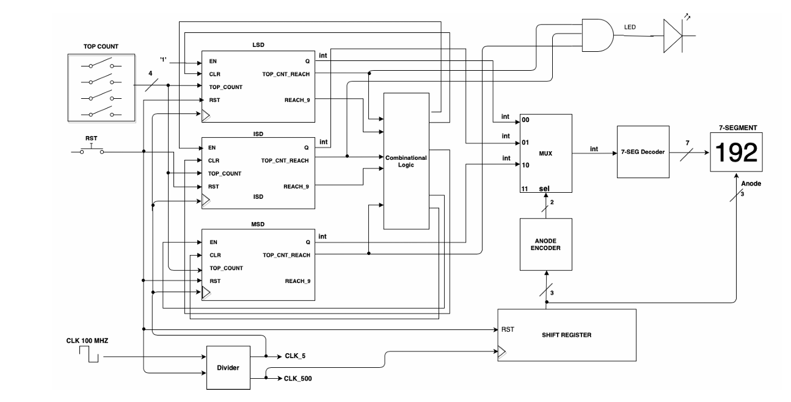
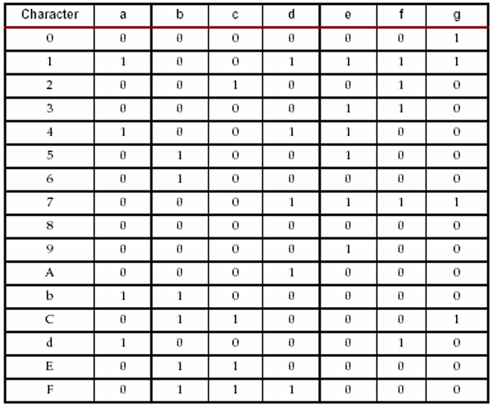

# decimal_counter_3D

This project we have been asked to implement a Decimal counter with 3 digits on the Basys3 FPGA board.

## Circuit Explanation:
First LSD counter counts from 0 to 9, while the others count from 1 to 9 (to prevent 009->000 instead of 009->010),
the combinational logic in the Top-level Module handles this. 
The Shift Register's purpose is to shift the right segment 110 -> 101 -> 011 -> 110,
The ANODE ENCODER encodes the location of the shift register and connects it to the right counter.
then the 7-segment decoder takes the integer values and changes them to the right vector combination to turn on the LEDs.

## Implementation:

Components:
1. [Divider:](new/Anode_encoder.vhd) input 100M [Hz] clock to 5Hz and 500Hz clock. 
2. [Counter:](new/counter.vhd) Counts from 0 to 9 (For each digit).
3. [Segment Decoder:](new/Seg_decoder.vhd) To Display the data.
4. [Mux 4x1:](new/Mux4x1.vhd) toggle between the 3 digits.
5. [Shift Register:](new/Shift_REG.vhd) moves the location of the digits.
6. [Anode Encoder:](new/Anode_encoder.vhd) Abode decoding for the Mux's Select.

## Documentations:
# Table 1: Display Characters and Resulting LED Segment Control Values

