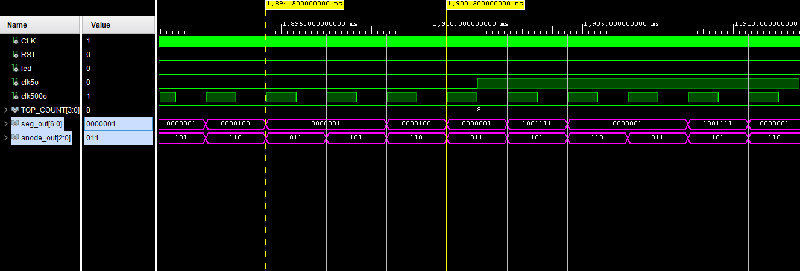

#  3 Digit Decimal Counter for basys3 FPGA Board

This lab project implements a 3-digit decimal counter using VHDL on the Basys 3 FPGA board.
The counter value is displayed on three multiplexed 7-segment displays and can be configured via DIP switches to count up to a user-defined top value (NNN).
The system uses modular components including counters, a shift register, a MUX, an anode encoder, and a 7-segment decoder to handle display control and logic.

## Circuit Explanation:
First LSD counter counts from 0 to 9, while the others count from 1 to 9 (to prevent 009->000 instead of 009->010),
the combinational logic in the Top-level Module handles this. 
The Shift Register cycles the active digit: 110 -> 101 -> 011 -> 110, (where 0 means turned on). 
The Anode Encoder maps the shift register output to the correct digit.
Then the 7-Segment Decoder converts integer values into LED segment vectors.

## Implementation:

Components:
1. [Divider:](new/Anode_encoder.vhd) input 100M [Hz] clock to 5Hz and 500Hz clock. 
2. [Counter:](new/counter.vhd) Counts from 0 to 9 (For each digit).
3. [Segment Decoder:](new/Seg_decoder.vhd) To Display the data.
4. [Mux 4x1:](new/Mux4x1.vhd) toggle between the 3 digits.
5. [Shift Register:](new/Shift_REG.vhd) moves the location of the digits.
6. [Anode Encoder:](new/Anode_encoder.vhd) Abode decoding for the Mux's Select.

## Waveform & Results:

In this waveform we can see the change between 009 to 010, The anode_out signal controls which LED turns on. and the seg_out control which number will goes out.

## Documentations:
### Table 1: Display Characters and Resulting LED Segment Control Values

